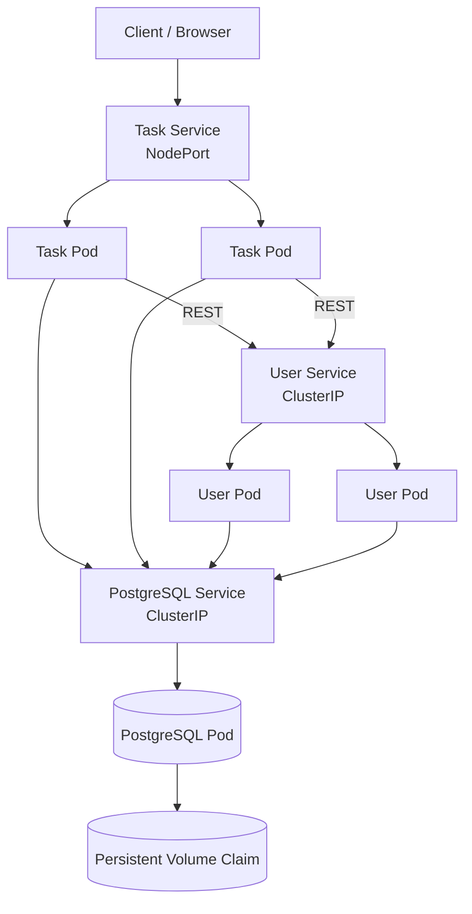

# Cloud Task App

This project was developed for Cloud Computing Assignment 1. The goal was to build a small microservice-based application, containerize it with Docker and deploy it using Kubernetes.

The application itself is a simple task management system. It has two backend services and a PostgreSQL database.

## Architecture

The application consists of:

- **User Service** - manages users
- **Task Service** - manages tasks
- **PostgreSQL** - stores the application data

Both application services are written in Python using Flask and expose REST APIs.

The Task Service also communicates with the User Service. When a new task is created, it sends a REST request to the User Service to check whether the supplied user exists.

For this assignment, both services use the same PostgreSQL instance but store their data in separate `users` and `tasks` tables.



## Services

### User Service

The User Service runs on port `5001` and provides endpoints for creating, reading, updating and deleting users.

Main endpoints:

```text
GET    /api/users
GET    /api/users/<id>
POST   /api/users
PUT    /api/users/<id>
DELETE /api/users/<id>
GET    /health
```

### Task Service

The Task Service runs on port `5002` and manages tasks.

Main endpoints:

```text
GET    /api/tasks
GET    /api/tasks/<id>
POST   /api/tasks
PUT    /api/tasks/<id>
DELETE /api/tasks/<id>
GET    /health
```

When a task is created, the Task Service checks the user through:

```text
GET http://user-service:5001/api/users/<user_id>
```

The name `user-service` is resolved by Kubernetes service discovery.

## Docker Images

The application images are available on Docker Hub:

```text
fazalraza3562/cloud-user-service:1.0
fazalraza3562/cloud-task-service:1.0
```

PostgreSQL uses the official image:

```text
postgres:17
```

Both Python services run using Gunicorn inside their containers and use a non-root application user.

## Kubernetes Deployment

The Kubernetes configuration is stored in the `k8s` directory.

```text
k8s/
├── 00-namespace.yaml
├── 01-postgres-pvc.yaml
├── 02-postgres-deployment.yaml
├── 03-postgres-service.yaml
├── 04-user-deployment.yaml
├── 05-user-service.yaml
├── 06-task-deployment.yaml
├── 07-task-service.yaml
└── secret.yaml.example
```

The normal deployment uses:

```text
PostgreSQL      1 replica
User Service    2 replicas
Task Service    2 replicas
```

PostgreSQL and the User Service use `ClusterIP` services because they only need to be accessed from inside the cluster.

The Task Service uses a `NodePort` service on port `30080` so that it can be accessed from outside Kubernetes.

The externally accessible endpoint currently provides the REST/JSON interface rather than a graphical frontend.

## Running the Project

Start Minikube:

```bash
minikube start
```

Create the namespace:

```bash
kubectl apply -f k8s/00-namespace.yaml
```

Create the database secret:

```bash
kubectl create secret generic cloud-db-secret \
  --namespace cloud-task-app \
  --from-literal=DB_NAME=cloudtasks \
  --from-literal=DB_USER=clouduser \
  --from-literal=DB_PASSWORD='YOUR_PASSWORD'
```

The real password is not stored in this repository. `k8s/secret.yaml.example` is provided only as an example.

Deploy PostgreSQL:

```bash
kubectl apply -f k8s/01-postgres-pvc.yaml
kubectl apply -f k8s/02-postgres-deployment.yaml
kubectl apply -f k8s/03-postgres-service.yaml
```

Deploy the User Service:

```bash
kubectl apply -f k8s/04-user-deployment.yaml
kubectl apply -f k8s/05-user-service.yaml
```

Deploy the Task Service:

```bash
kubectl apply -f k8s/06-task-deployment.yaml
kubectl apply -f k8s/07-task-service.yaml
```

Check the running pods:

```bash
kubectl get pods -n cloud-task-app
```

The expected normal state is:

```text
PostgreSQL      1 pod
User Service    2 pods
Task Service    2 pods
```

To check the Kubernetes services:

```bash
kubectl get services -n cloud-task-app
```

To get the external Task Service URL:

```bash
minikube service task-service \
  -n cloud-task-app \
  --url
```

The exact IP depends on the local Minikube environment.

The health endpoint can be tested with:

```bash
curl http://<MINIKUBE-IP>:30080/health
```

A healthy response looks like:

```json
{
  "database": "connected",
  "service": "task-service",
  "status": "healthy"
}
```

## Horizontal Scaling

The User Service and Task Service have separate Kubernetes Deployments, so they can be scaled independently.

For example, during testing I scaled the Task Service from two replicas to four:

```bash
kubectl scale deployment task-service \
  --replicas=4 \
  -n cloud-task-app
```

At that point the deployment was:

```text
PostgreSQL      1 replica
User Service    2 replicas
Task Service    4 replicas
```

The application continued to work while the Task Service was scaled to four pods.

It can be returned to the normal configuration with:

```bash
kubectl scale deployment task-service \
  --replicas=2 \
  -n cloud-task-app
```

## Persistent Storage

PostgreSQL uses a Kubernetes PersistentVolumeClaim called `postgres-pvc` with `1Gi` of requested storage.

I tested the persistent storage by creating users and tasks and then deleting the PostgreSQL pod:

```bash
kubectl delete pod \
  -l app=postgres \
  -n cloud-task-app
```

Kubernetes created a new PostgreSQL pod automatically. The PVC remained attached and the users and tasks created before deleting the pod were still available afterwards.

This means that the database data is not tied to the lifetime of a single PostgreSQL pod.

## Health Checks

Both application services expose a `/health` endpoint.

Kubernetes uses these endpoints for readiness and liveness probes.

PostgreSQL is checked using `pg_isready`.

This allows Kubernetes to detect whether a pod is ready to receive traffic and whether a running container is still healthy.

## Security

A few basic security measures are included in the project.

- Database credentials are stored in a Kubernetes Secret.
- The actual database password is not committed to Git.
- The application containers run as a non-root user.
- PostgreSQL and User Service are not exposed outside the cluster.
- SQL queries use parameters instead of directly concatenating user input.
- CPU and memory requests and limits are configured for the containers.

For a production system, additional measures would be needed, such as authentication, HTTPS, network policies and stronger secret management.

## Benefits and Challenges

One benefit of this architecture is that the User Service and Task Service can be scaled independently. If the Task Service receives more traffic, additional Task Service replicas can be added without also increasing the number of User Service replicas.

Kubernetes also handles service discovery and load balancing between the pods. If an application pod fails, the Deployment can create a replacement automatically.

Persistent storage is another benefit. The PostgreSQL data is stored separately from the database pod itself, so replacing the pod does not remove the application data.

The main disadvantage is that a microservice architecture introduces more complexity than a single application. There are more containers, network connections and Kubernetes resources to configure and manage.

There is also a dependency between the Task Service and User Service. When a task is created, the Task Service needs the User Service to check the user. If the User Service is unavailable, creating a new task can temporarily fail even if the Task Service itself is running.

The PostgreSQL database is also only running as one instance. The PVC protects the stored data when the pod is replaced, but the current setup does not provide database high availability.

## Design Choices

I kept the application intentionally small because the focus of the assignment is the cloud architecture rather than building a complex task management system.

The two application services are separated so that they can be deployed and scaled independently. It also gives a simple example of one service using the REST API of another service.

Both services currently use one PostgreSQL instance. A larger microservice system could give each service its own database, but using one PostgreSQL instance keeps the infrastructure simpler for this assignment.

PostgreSQL is only deployed with one replica. Properly scaling a relational database requires replication and additional database-specific configuration, which is outside the scope of this project.

NodePort was used because it provides a simple way to expose the Task Service outside a local Minikube cluster. In a production Kubernetes environment, an Ingress or LoadBalancer would normally be more appropriate.

## Technologies

- Python
- Flask
- Gunicorn
- PostgreSQL
- Psycopg
- Requests
- Docker
- Kubernetes
- Minikube
- Git
- GitHub

## Author

Muhammad Fazal Raza
